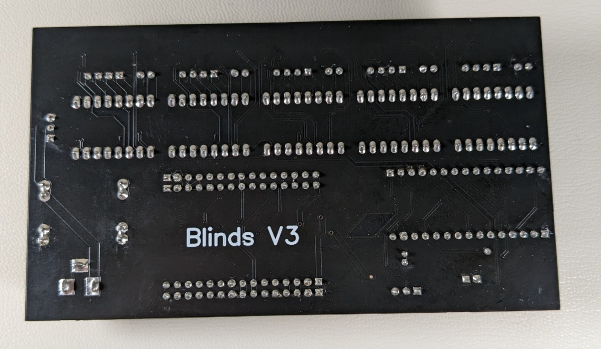

# Blinds-V3 - Amir Gorkovchenko (2023-2024)
Successor to Blinds V2.

### Note
Core libraries and needed files can be found in Core branch

Ever since homeassistant locked away certain features behind a paywall, a new solution was needed.

A platform called TUYA Smart allowed for developers to create an app that will communicate with a custom IOT device.

Several other features were added along with the new platform. The board was custom designed with jlc pcb.
The stepper motors now have easing capabilities making them much more pleasant

Utilizes parallel processing:
 - atmega328p as Stepper controller
 - esp8266 as bridge to TUYA service

Both processors communicated via a Serial protocol developed by TUYA

### Plans for V4
V4 is currently in development and plans to remove the need for stepper cat wires. A new wifi mesh system will be used to link each blind and home device to a master controller.

### Photos
All major components have been designed to be removable and easily replaceable:

### Video
A simple demonstration of the stepper motors and app:

https://drive.google.com/file/d/1dFUuMsUVTf0P5or7KqLXErIDlCNwR8sr/view?usp=drive_link